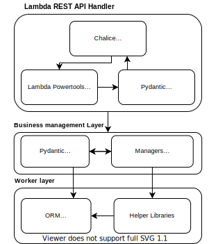
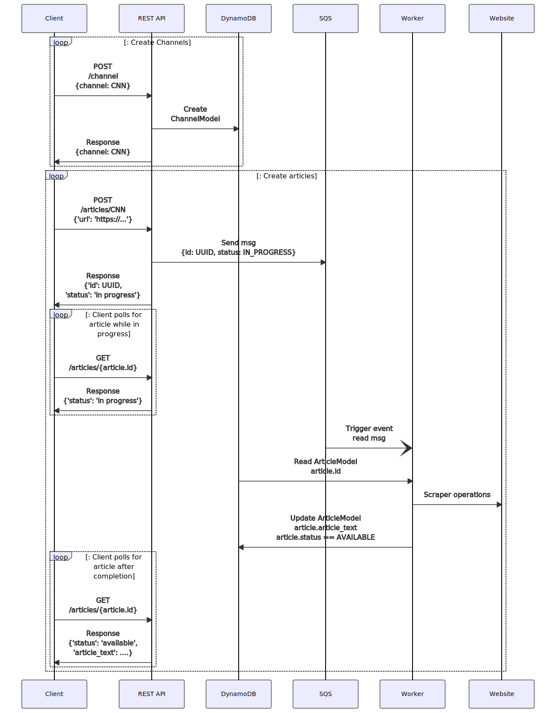

# Qvik recruitment exercise solution

## Requirements.
This implements the functional requirements for the Qvik backend developer exercise.

- [x] Able to manage channels.
- [x] Able to manage articles for a channel.
- [x] When adding articles, only the URL is required. The Application will fetch the URL and calculate the word count (HTML tags stripped).
- [x] Fetching the URLs and counting the words is to be done in the background after the article URL has been received.
- [x] Can search articles within word count ranges e.g. 0-100, 100-500, 0-501.

To illustrate more realistic production style implementation patterns this has been implemented as a AWS Native system.

The following technical requirements are fully covered however.

- [x] All functionality should be implemented in one application.
  - [x] REST API can be fully developed using local server
  - [x] No multiple management systems are required.
- [x] REST API that accepts and returns JSON.
- [ ] In memory database for persistence layer, e.g. SQLite.
  - [x] DynamoDB Singletable database has been used instead.
  - [x] For local development this works easy and translates to a deployable system. 
- [x] Usage and deployment instructions/scripts/etc. should be included.
  - [x] Swagger documentation
  - [x] Deployment script
  - [x] Integration tests that illustrate how to use the system
- [ x] Application must be able to be run locally as a standalone application
  - [x] `chalice local` supports this.
  

## Systems used to implement application.

AWS Chalice has been used as a modern microframework for Python based serverless backend development.

An opinionated list of components have been integrated into this:

- Pydantic
  - Input validation
  - Data separation layer
  - All data that ingress/exgresses over HTTP or SQS is typed through Pydantic
  
- PynamoDB
  - Object layer for DynamoDB
  
- aws-powertools
  - Parsers and utilities

## System sequence diagramme.

## API Docs

Swagger documentation is available after deployment at: `$base_url/api-docs`

For the current development deployment this is: https://snsm7ef4y8.execute-api.eu-west-1.amazonaws.com/api/api-docs

## Deployment

Update the AWS Profile in `deploy.sh` and execute.

For a more serious application i would have maintained some Terraform scripts for creation of persistent infrastructure, but this would have been overengineering compared to this basic shell script.

## Testing

Integration tests are included that perform HTTP requests so as to be able to test both locally and AWS Lambda deployed instances of the system-as-a-whole.

Tests are implemented using PyTest and [Allure](http://allure.qatools.ru/ "Allure")

Tests can be executed with the `run-tests.sh` script, if Allure is installed create the test report with: `allure generate test-results/`
